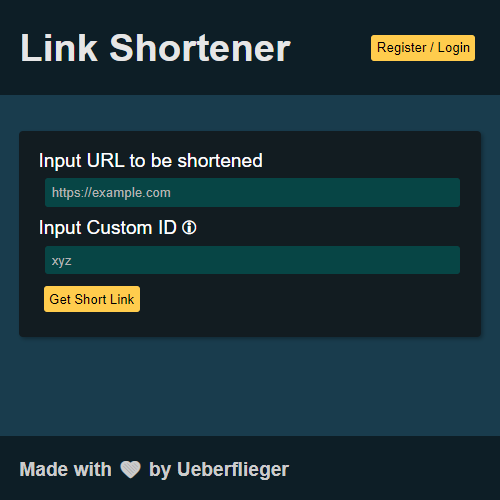

# ⚠️ Important Note
> This code is in early development. The main features don't work. Updates will come quite regularly in the next time (maybe).

After installing the dependencies (`npm install`)  
You can start the development by running `npm run dev`  
Build static files by running `npm run build` and then serve them by running `npm run start`

# link-short
A simple easy to deploy Link Shorter using express.js as the webserver, passport.js for user authentication and vue.js for the frontend.  

# Docker
1. Change the environment variable in the `Dockerfile` (Optional)
2. Build the Docker image
```
docker build -t link-short
```
3. Run the Docker image
## Without environment variables configured
```
docker run -d --name link-short \
 -e SESSION_SECRET=[your_session_secret] \
 -v link-short:/link-short/server/data/ \
 -p 3000:3000 \
 --restart unless-stopped \
 link-short
```
## With environment variables configured
```
docker run -d --name link-short \
 -p 3000:3000 \
 -v link-short:/link-short/server/data/ \
 --restart unless-stopped \
 link-short
```
# Manual Install
1. Install dependencies
	- For production
```
npm ci
```
	- For development
```
npm install
```
2. Configure the .env fille in the server directory (A sample is provided as `.env.sample`)
```
cp server/.env.sample server/.env
```
After copying the sample file don't forget to configure it
3. Start the server (make Shure you are in the home directory of the application)
```
npm start
```
Then go to http://localhost:3000

# Api
> ⚠️ API will most likely change with the new updates. Also new docs will be coming
## Endpoints without Authentication
- [Redirect to link](docs/redirect.md) : `GET /:id_of_link`
- [Create new link](docs/create_new_link.md) : `POST /api/new`

## Endpoints for Authentication
- [Create new user](docs/user.md#create_user) : `POST /auth/register`
- [Login](docs/user.md#login) : `POST /auth/login`
- [Logout](docs/user.md#logout)
### For every user
- [Get if logged in](docs/user.md#user_status) : `GET /auth/isloggedin/`
- [Remove user](docs/remove_user.md#user) : `DELETE /api/user/remove/me`
### For Admin
- [List all users](docs/list_users.md) : `GET /api/user/all`
- [Change user type](docs/change_user.md) : `PATCH /api/user/alter/:user_id`
- [Remove user](docs/remove_user.md#admin) : `DELETE /api/user/remove/:user_id`


## Endpoints with Authentication
- [Delete link](docs/remove_link.md) : `DELETE /api/remove` (Only links that I own)
- [List my links](docs/list.md#my) : `GET /api/my`

## Endpoints with Admin specific Authentication
- [Delete link](docs/remove_link.md) : `DELETE /api/remove` (Any links)
- [List all links](docs/list.md#all) : `GET /api/all`

# License
This project is covered under the [MIT](LICENSE) License